## Overview

The objective of this project was to create an interactive site that was responsive to two different screen formats. Our team of five Interaction Design Studio 1 students was given a number of domains to choose from, and we chose fostering a pet because of our team members’ shared interest in the topic. We were also required to narrow our scope to a specific client, user group, pain point, and set of interactions that would resolve that pain point and be beneficial to the client.

We created a subset of screens for an interactive site for a made-up client, the Allegheny County Rescue Association (ACRA). The ACRA and the rescues that joined it were our stakeholders, and the people looking to foster dogs were our site’s users. The ACRA’s goal is to save as many animals as possible, while maintaining financial feasibility as a nonprofit. Our solution targeted the user pain point of lack of transparency in the application to foster process. A more transparent application process means higher quality applications and efficient time management, which ultimately allows the ACRA to collect more fees and save more animals.

<a href="https://www.figma.com/proto/32d3vYLwoPrROHQ4OStTAp/Hi-Fi-Mobile?node-id=241%3A1019&viewport=454%2C967%2C0.12353640049695969&scaling=scale-down" target="_blank">Mobile Prototype</a>

<a href="https://www.figma.com/proto/3vkikLzlKgMc34z33o9Fb5/Hi-Fi-Desktop?node-id=1%3A634&viewport=291%2C579%2C0.07974327355623245&scaling=scale-down-width" target="_blank">Desktop Prototype</a>

## Timeline and Process

Over the course of 5 weeks, our team conducted a number of research and design activities. Our initial research, which we completed in a week, started with conducting 15 directed storytelling sessions. I then compiled an affinity map, and our team compiled journey maps to narrow our scope. On the design side, we went through a standard prototyping process of creating low- , medium-, and high-fidelity designs, receiving critique along the way from instructors and fellow students over the next 4 weeks. Finally, we delivered a pitch to our fictional client showcasing our design and its benefits to their organization.

## Role

My main role in the project was research lead. I recruited all of our research participants, conducted 4 directed storytelling sessions, and compiled an affinity map of all our team’s interviews. In addition, I designed the screens that showed users the results of their application decision and corresponding next steps for both mobile and desktop.

## Research

### Recruiting our Participants

To begin our research process, our team members agreed we were all interested in improving the pet fostering experience, however, none of us had recently fostered a pet or knew anyone who did. How might we recruit 15 participants in less than a week during a pandemic? Reddit! I posted on a number of pet-related subreddits to find pet owners who would be willing to speak with us, and the subreddit r/BeforeNAfterAdoption was very kind to us. We ended up receiving well over 15 interested participants. In hindsight, it’s no surprise people wanted to share their pet adoption stories!

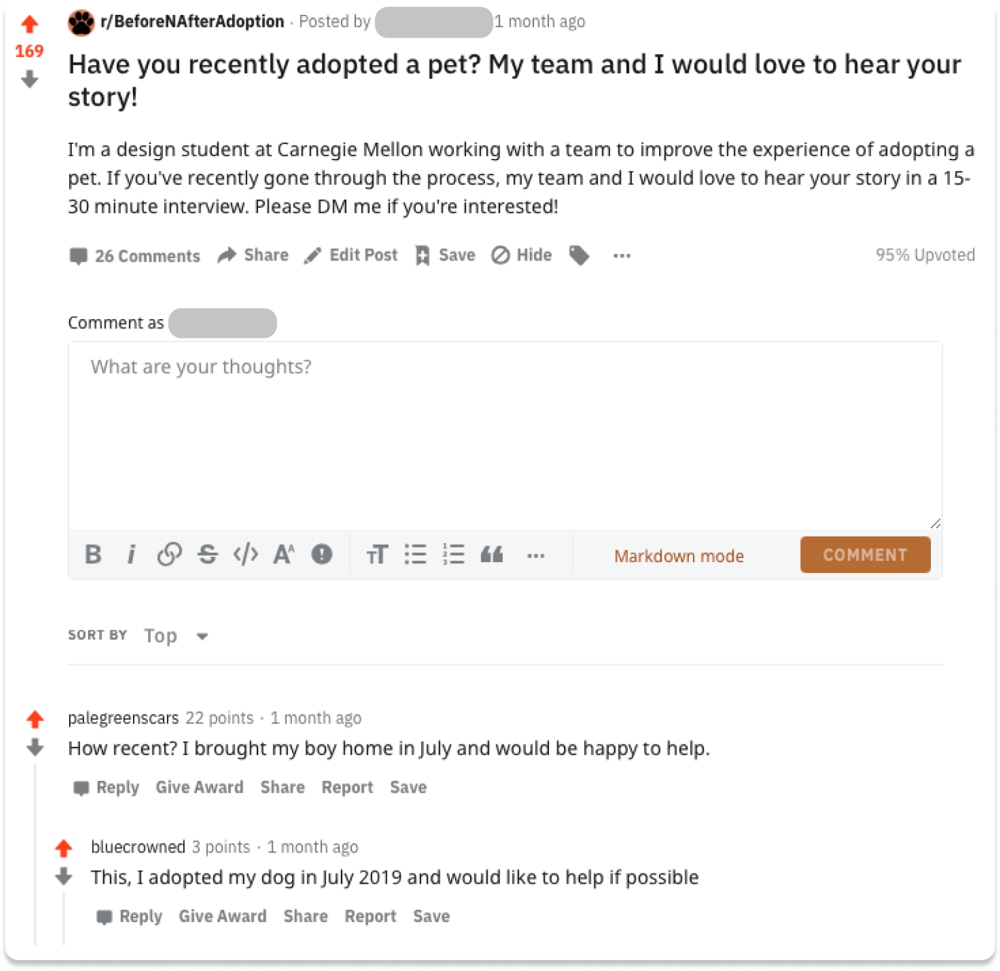

### Conducting our Interviews

With our recruiting pipeline set up, it was time to figure out our interview guide. We used the Directed Storytelling method in our interviews, asking each participant to recount their most recent experience adopting or fostering a pet and asking follow-up questions from there. We mainly interviewed people who recently adopted a pet, and we were also lucky enough to hear from people who either ran or volunteered at rescues, and their perspective was invaluable. As we conducted our interviews, we individually filled out journey maps which we then consolidated into an affinity map, the key findings of which we present next.

### Affinity Map

#### We Must Mediate Relationships Pet Owners Form

One way in which I made sense of our interviews was by creating an affinity map. At a high-level, what I came to understand from our interviews is that, throughout the pet ownership process, pet owners build relationships with other stakeholders like the rescue or their veterinarian, and that in order for us to improve the pet fostering application experience, we must mediate those relationships with their nuance in mind.

#### Pet Owners are Willing to Make Sacrifices

While the most important relationship a pet owner forms is the one with their pet, it truly takes a village. Before even making the decision to foster, future pet owners often had to make significant life changes like moving, or they had to convince skeptical partners, yet all our participants were willing to make sacrifices because they truly care for animals and wanted to connect with them. Drawing from our affinity map, we sought next to consolidate our findings into a journey map to help narrow our problem space.

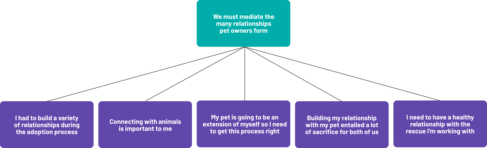

### Consolidated Journey Map

In addition to affinity mapping, we consolidated the journey maps we created after each interview into one journey map in order to refine our understanding of the pet fostering experience.

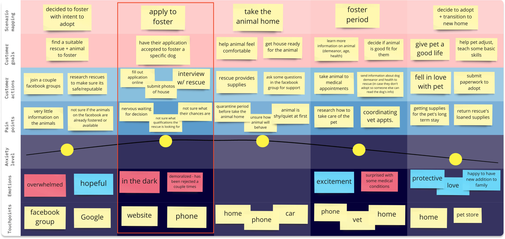

We chose to focus on the apply to foster phase because we believed a responsive interaction design could address the lack of transparency into the process for prospective pet fosterers. Next, we built out a journey map within the apply to foster phase to refine our understanding of this part of the problem space.

### Focus Area Journey Map

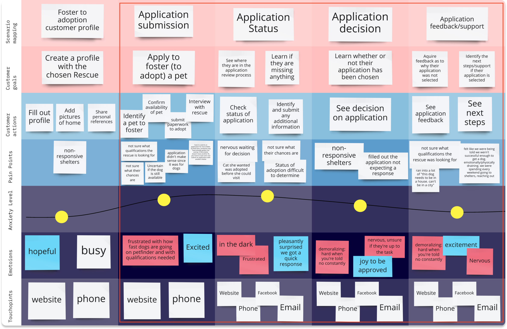

We further narrowed in on the point in time after the user has filled out a basic profile since what comes after has fewer established design patterns. Now that we had sufficiently narrowed our scope, we began prototyping our ideas on paper.

## Design

### Paper Prototype

To begin the design phase of our project, we created individual paper prototypes to accomplish the goal of increasing transparency into the process of finding an animal, applying to foster it, and receiving the application’s results. We met to present our ideas and took note of what aspects worked well in our individual sketches before taking to one iPad to draw out a synthesized paper prototype combining the best of our ideas.

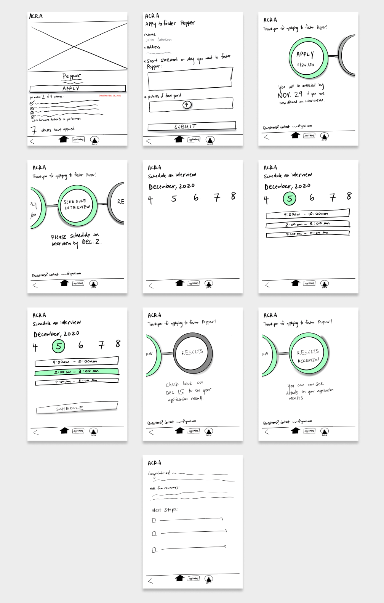

From our in-class critique, we learned that several word choices impacted how our design was received. The phrase “7 others have applied” caused confusion among both groups of students we received critique from, with one saying this would deter them from applying and the other saying it would motivate them to apply quicker. We ultimately decided to take this phrase out entirely because the application process for fostering is done on a rolling basis, so the number of applicants would also need more information on the stage of applying they are on. Instead, we included a line saying the animal was available for applications because this made more sense in the fostering context.

Moving to our digital prototype, we also kept in mind that visual affordances would be key, since our paper prototype testers had confusions about what was clickable.

### Mid-Fi Prototype

#### Iteration 1

For our first iteration of the Mid-Fi prototype, we individually focused on a different part of the prototype and built those pages out.

We implemented changes from previous critiques, focusing mainly on creating clearer visual affordances. Since we were now working on a digital prototype in higher fidelity, we incorporated more details and visual design elements that would work to tackle these problems.

In order to make for a clearer call to action, we edited our use of icons and underlining. To increase visibility, we added more context on the timeline using intermediate steps.

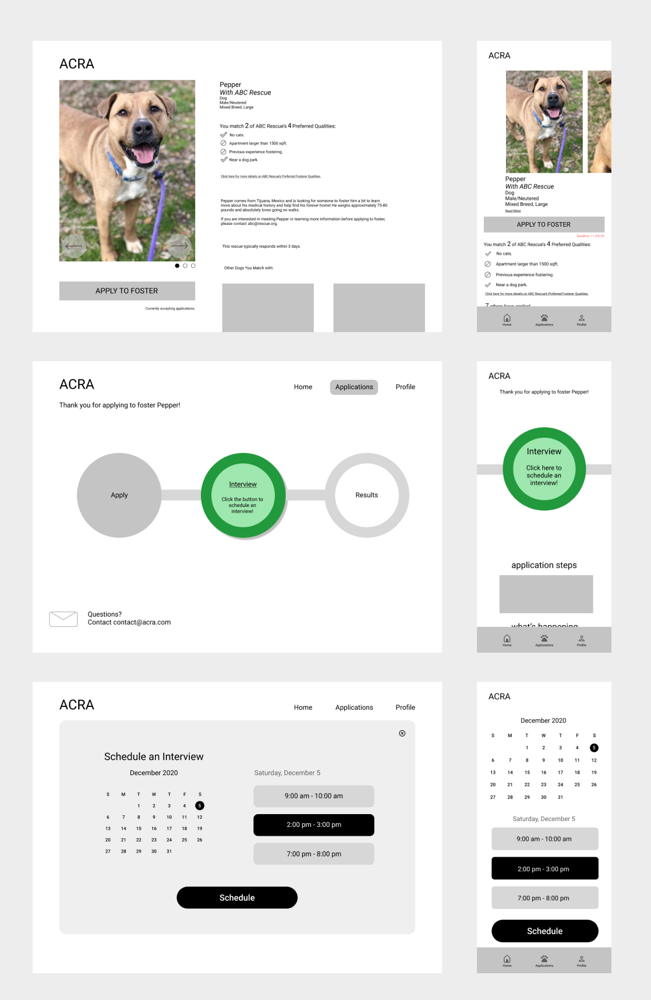

#### Iteration 2

While our first Mid-Fi prototype worked to tackle clearer call to action and increased visibility, our in-class critique showed us that there was still room for improvement in these areas. We were prompted to further clarify situations such as the rejection process.

In our second iteration, we tackled these by fleshing out each page in greater detail. We created a rejection page and more text to explain each situation.

Moving into our final prototype, we also focused more heavily on visual design, tackling issues with whitespace, crowding, and consistency across pages. We improved the visual design by creating a design system to allow for consistent screens and branding. We also added digital prototyping elements such as vertical scrolling, horizontal modules, and other interactions.

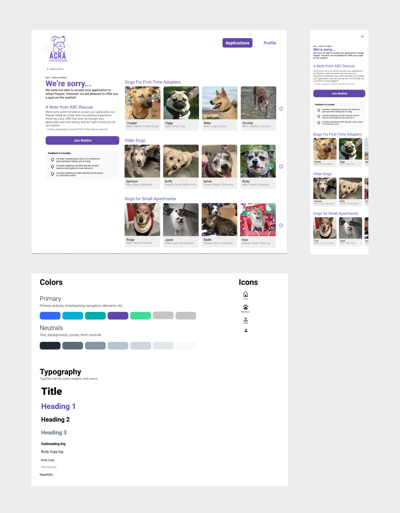

## Final Prototype

When refining our final iteration, we made sure to keep our primary goal in mind: did the changes we make aid either the user or the client in their mission? Would the user actually have an easier time interacting with our design?

We went through the elements one-by-one, thinking from the user’s perspective: “Would our designated user, John, be discouraged if he didn’t match a lot of the preferences for his desired rescue dog, Pepper?” “Is the upload button a clear call to action?”

We also worked on reinforcing their hierarchy and balancing the design. For example, we edited the sub-heading “What’s happening with your application?” to simply “What’s Happening...” so that it would be balanced with the other subheading “Next Steps...”

To help the user see where they were in the application process, we made sure to include a timeline. While the first thing the user would see when visiting the page would be the step they are currently on, a swipe down would condense the timeline and allow the user to see the progression of their application.

In order for the user to get notified of the changes in their application, we decided that banner notifications for mobile would be the most direct method.

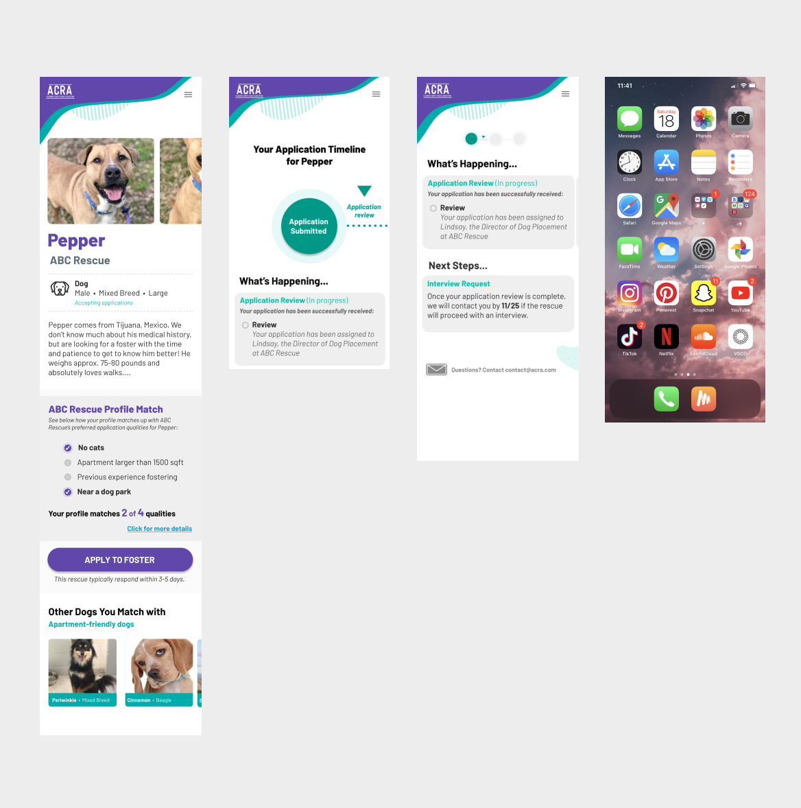

When the user passes the interview stage, the user can receive one of three results after several weeks: an acceptance, a waitlist, and a rejection. We decided to showcase a waitlist decision that eventually leads to the user being accepted off of it. That way, we could show two of the possible results in a natural manner rather than simply presenting the two as alternatives.

We also played with the layout of the final results screen and decided to place the resources lower on the screen, and thus the hierarchy. We emphasized the steps that come after the user has been accepted to foster.

Now, we had a series of screens where the flow from one step to the next was more natural, and where the calls to action were clearer. A user’s process from landing on the pet’s profile page to receiving their results was clearer and more transparent.

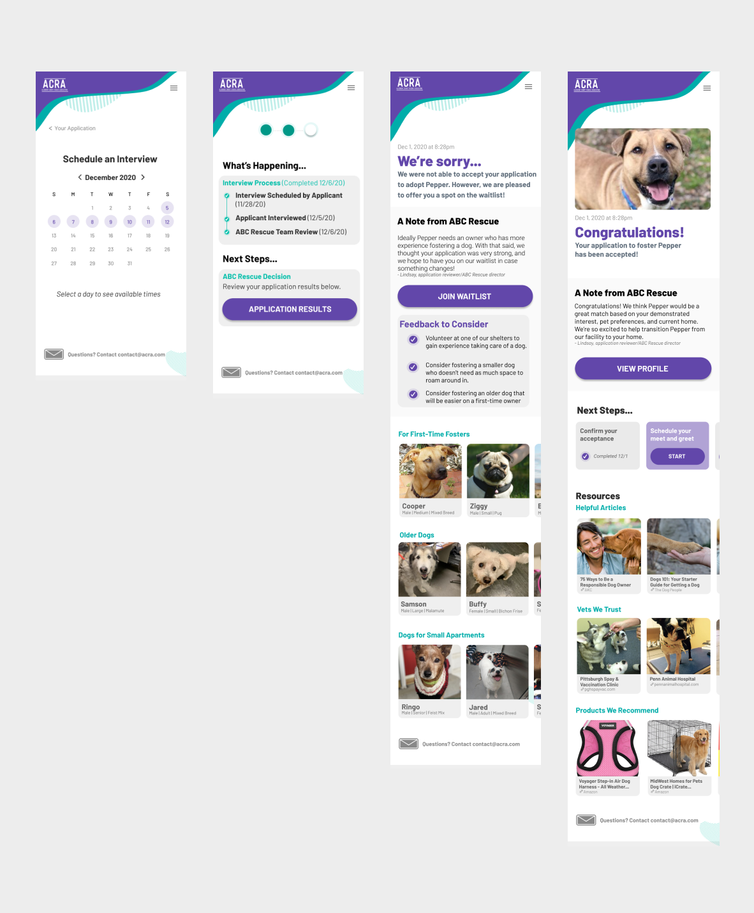

## Pitch

### Setting the Stage

Our team felt that in order to present a cohesive and compelling narrative, it was crucial to ‘set the stage’ for our solution. By sharing the attention grabbing statistics of the current landscape for shelters across the nation our audience would be able to immediately identify the domain in which our project lived. This was immediately followed by a direct address to our target audience (the Allegheny County Rescue Association) an identification of the funding source, and above all, the goal of the ACRA and ultimately, our project: to save more animals.

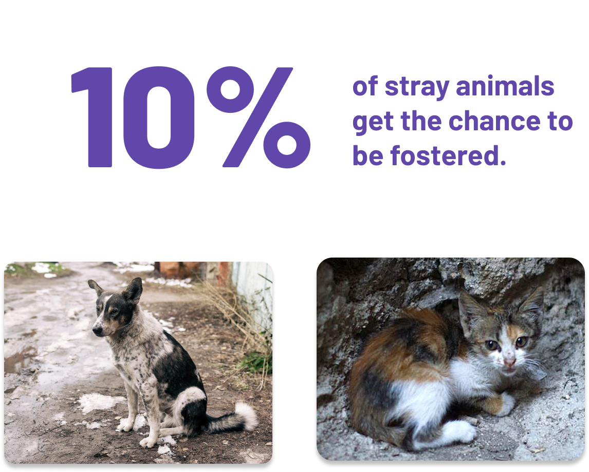

### Identify the Problem Space

Before offering our solution, we would need to identify the problems. We did so with accompanying data acquired in our earlier rounds of research, adding a sense of validity to our assessment. The main issues we identified were:

- Decentralized structure
- Scattered communication
- Lost time
- Lack of transparency

### User-driven Solution

We presented our solution in the scenario of John Jonson and his journey to adopting the dog he fell in love with, Pepper, allowing our solution to be driven by the experience of the user. This showed our audience how the solution would look through the eyes of their potential applicants. Our goal in doing so was to keep the audience engaged as John explored the various functions and features.

This also gave us an opportunity to discuss the key benefits of our design in a solution that the audience was now familiar with and they could associate these benefits more clearly with stages of the application process.

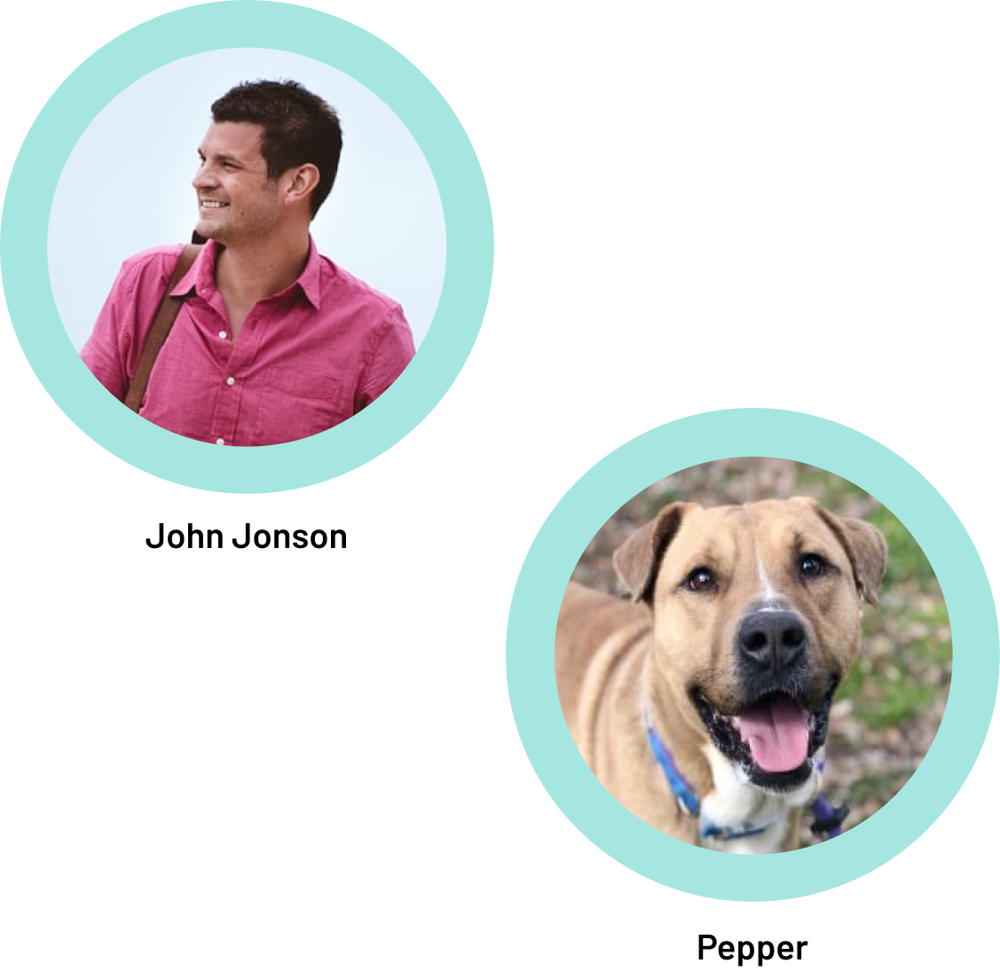

### Why Good Design Matters

To conclude, it was important to demonstrate for our client the connection between good design and a successful foster placement. We chose the idea of ‘first impressions’ because it was a concept that was familiar and relatable to all.

We also wanted to reiterate the unique benefits our solution provided to the both the applicants and the rescues, including:

- Efficient and streamlined application process
- Increased transparency
- High-quality applications
- Opportunity to give more time back to volunteers

For rescues in particular, we believed increasing transparency in the application process would speed up that process, meaning each animal would spend less time in a shelter. This would ultimately allow rescues to place more animals, collect more fees, and most importantly, save more animals.

## Takeaways

I’m so proud of the work our team put in. Each team member brought something unique to the table that meshed really well with everyone else’s contributions. Designing in service of animals and their owners brought warm feelings to my heart throughout the process, and knowing our design might help a rescue save more animals made all the hours I put in worth it! This project also helped me narrow in on my interest in research. I realized how much I wanted to understand and advocate for the people who would be using our product, and I noticed how impactful having a thorough understanding of who our user was and what they needed made for a smoother and more impactful design process.
