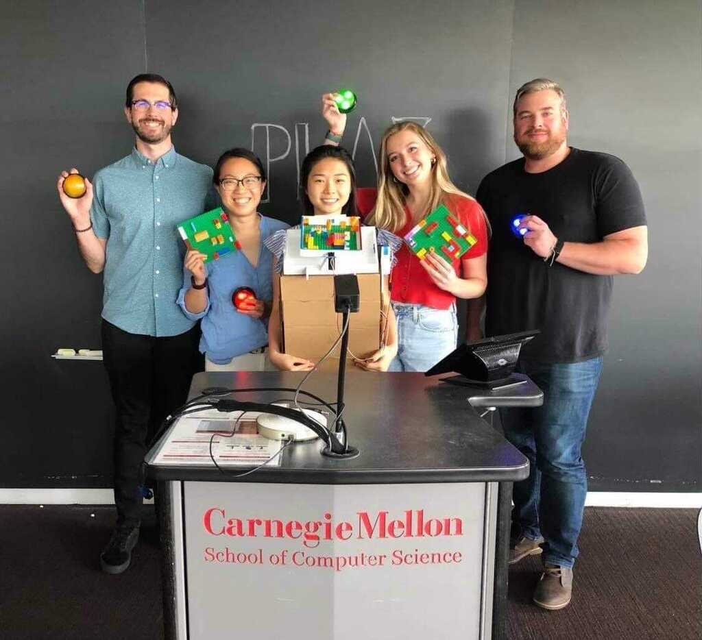

<!-- TODO: add website content -->
<!-- 
<iframe src="https://player.vimeo.com/video/547798818?badge=0&amp;autopause=0&amp;player_id=0&amp;app_id=58479" frameborder="0" allow="autoplay; fullscreen; picture-in-picture" allowfullscreen style="position:absolute;top:0;left:0;width:100%;height:100%;" title="Are We There Yet?"></iframe>
 -->

    

        <h4>Martin</h4>
    

Martin combines haptic and kinetic input, the movement of the car, and cooperative play to create shared presence for families.

What sets Martin apart most is that the seat itself becomes the controller and players have to physically move to use it. Reframing this affordance of the car points the way to numerous use cases for existing sensors and opportunities to introduce new sensors.

‍

To test the basic viability of this combination of interaction, movement, and cooperation, the first version of Martin used foamcore, pool noodles, and Legos. Participants used our static car simulator seats as controllers to collaboratively navigate a maze using a marble. Even with this simple, analog prototype, players laughed together often, and they were highly motivated to complete the maze.

    

        <h4></h4>
    

This initial success didn’t come without its challenges, however. Even in a static car simulator, players often came away feeling dizzy after staring down at the game board for so long. With the basic concept validated, however, the next step was to build a functioning digital prototype in order to understand how players would react in a moving car – especially with respect to carsickness – and explore the technical side of how 99P Labs might implement a production version.

To prevent carsickness, the next version of Martin was much taller to bring the game board closer to the horizon line, and it also incorporated auditory feedback so players wouldn’t have to consistently look down at the game board. This also meant the proof of concept game changed from a maze to one more like Simon Says in order to incorporate auditory feedback.

To implement a version of Martin fit for a moving car as well as explore underlying technologies, this higher-fidelity version culminated in a cyber-physical system where players each sat on a phone enclosed in a specially-designed pillow that transmits its accelerometer data to a Raspberry Pi which correspondingly turns servo motors using Arduino, thus moving the game board. Check out the <a href="https://github.com/victor-grajski/martin" target="_blank">code on GitHub</a> if you're so inclined!

    

        <h4></h4>
    

Testing with families confirmed that Martin successfully fostered cooperation and connection. Players loved how they had to physically move in order to control the game, and parents loved how their kids had to talk to each other and work together in order to play. To add personalization to Martin, we allowed kids to create their own custom Lego game boards. Kids loved being able to express their creativity, and they wanted to keep playing with new boards and try ones that others created.

    

        <h4></h4>
    

One thing that became clear with Martin is that the ideal age range skewed slightly older than some of our other prototypes. Kids older than 6 engaged immediately, however, younger kids, especially those in car seats, struggled to move the board with their seat, and they disengaged as a result. Older kids also found controlling Martin challenging, however, this challenge motivated them and deepened their engagement.

    

        <h4></h4>
    

As a proof of concept for combining a seat controller, car movement, and cooperative play, Martin was a resounding success, and it points to a number of opportunities for further iteration. As mentioned, younger kids in car seats often disengaged because it was hard to use their seat as the controller, and even older kids faced difficulty with it, especially forward and backward movement. An easy way to alleviate this would be to use the bottom of the seat solely for left-to-right motion and place a sensor in the backrest that would control the forward-backward movement because using one’s upper body to control that axis is much easier in a car than using one’s lower body. Placing sensors in both parts of the seat would also keep players in a safe seating position because kids had to move all over the place to play our prototype!

‍

Another opportunity lies in customizing game boards. As mentioned earlier, kids loved being able to express themselves and share their creations, and this is exactly what Lego leverages with its Lego Life social media platform. In future iterations, we would want to emulate Lego to create a new venue for expression and play to open up opportunities for cross-car connection.

    

        <h4>Project Website</h4>
    

In addition to building and testing Martin, I designed and built two major versions of our responsive project website: one during the Spring semester, and another during the Summer semester, using Figma. I built <a href="https://99p-labs-mhci-2021.webflow.io" target="_blank">the Spring version</a> with Webflow since I hadn't used it before and wanted to try it, and I built the Summer version in React which built off of the earlier Webflow work.

The Spring semester focused on research, and at the time, our team had identified a gap between what people say about the car and what they do in it. They told us their time in the car felt wasted, yet they also used the car as a respite from the demands of everyday life. We encapsulated this tension into a video which I featured on the homepage because of the immediate, visceral engagement it invited.

Visually, the site took on a glossy, formal tone with its prominent use of the Apple Garamond typeface and full-width images. However, we also wanted to visually convey a "work in progress" tone on the case stduy page by featuring hand-drawn, black and white imagery and a two-column grid to evoke a bulletin board. This visual tension reflected the tension our team was feeling after conducting our initial research. Much like people's experiences in the car, the Spring website simultaneously attempted to blend a Mad Men-esque advertisement on the side of a building for yet another Jaguar with a child's chalk drawing, full of unrefined wonder and promise, on the otherwise barren concrete wall beneath that ad.

    

        <h4></h4>
    

In contrast, the visual coherence in <a href="https://playswervo.netlify.app" target="_blank">our Summer website</a> reflected the clarity our team worked hard to achieve. Through rapidly ideating, building, and testing – as evidenced by Martin – we honed in on families as our target users, and we decided to focus on play as a means of connection. To that end, the site featured playful, bright colors, simple shapes, and hand-drawn elements. It did retain the glossiness of full-width videos and images, however, they purposefully featured families to make our intended user clear. To ease the reading experience, it minimized the use of two-column layouts, saving them for important callouts at the beginning of new sections. In the vein of formalism giving way to playfulness, we chose the more playful, rounded Comfortaa typeface over Apple Garamond.

    

        <h4>Takeaways</h4>
    

On a personal note, I thoroughly enjoyed working on a team of fellow designers and researchers. I experienced firsthand how impactful rapidly ideating, building, and testing functional prototypes can be, and I've been hooked since! I also feel a deep sense of accomplishment having learned Arduino and Raspberry Pi on-the-fly to build something that brought joy to families, and I only wish our team had more time to continue iterating. While we robustly evaluated our ideas, I'm most proud of how generative and creative our team was, if I do say so myself. They gave me the opportunity to let my creativity run wild and express that creativity through the medium of code, something I will carry with me, and I am eternally grateful for that.

