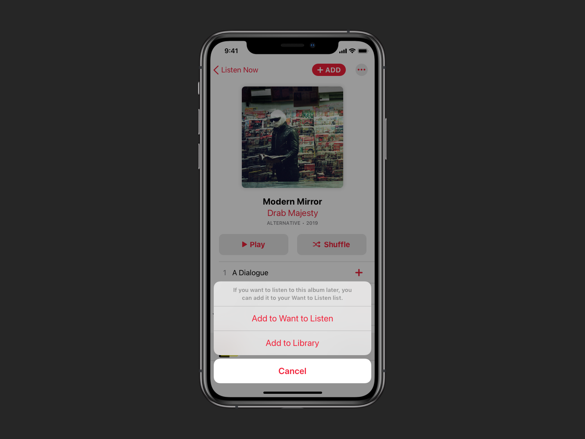
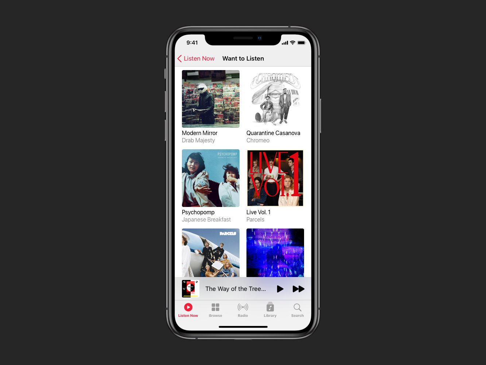
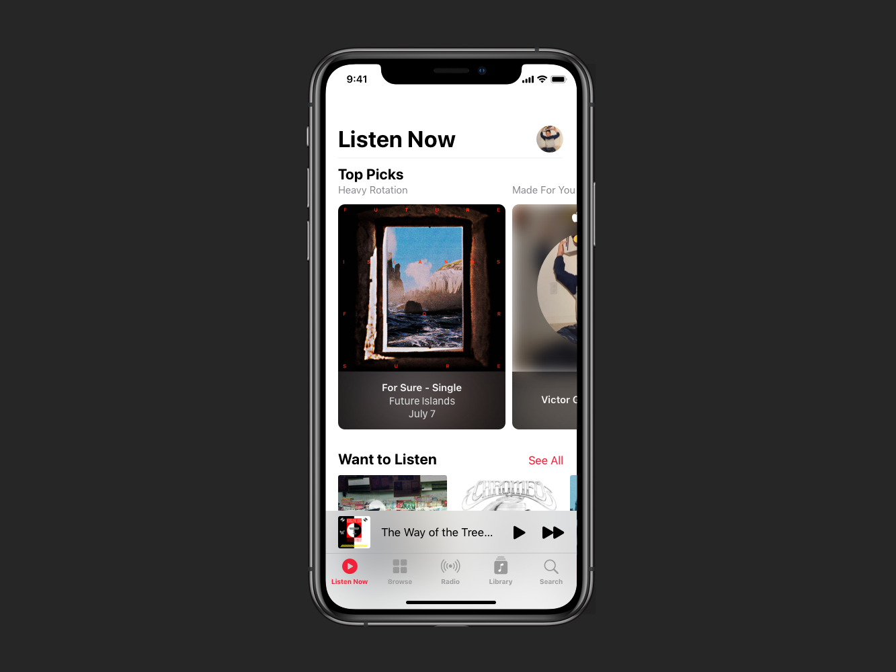

<iframe class="kg-image" style='width:100%;height:700px;margin-top:8vw;' src="https://www.youtube.com/embed/GusiCJYBcbs" frameborder="0" allow="accelerometer; autoplay; encrypted-media; gyroscope; picture-in-picture"></iframe>

    

        <h4>Target User</h4>
    

For this project, I'm targeting a listener – let's call them Sam – who likes to discover new music often and gets regular recommendations from friends and Apple Music. However, Sam isn't always able to follow up on music recommendations in the moment. Sam often forgets, and when they do remember, they're usually unable to conjure what it was they meant to listen to.

    

        <h4>Scenario</h4>
    

Let's say Apple Music shows a carousel of albums similar to the one Sam user recently listened to; in this case, Joyland by TR/ST. They see an album in that carousel, Modern Mirror by Drab Majesty, that they’ve been meaning to listen to for a while, but they don't have time to listen to it right now. A week goes by, Apple Music’s recommendation has been replaced, and when Sam does have time to listen to new music, they can't remember which album they meant to listen to. If only there were a way to save recommendations for later!

    

        <h4>Key Design Decisions</h4>
    

With a clear gap identified, what should saving music look like? After reviewing similar features in Apple's Podcasts, TV, Books, and News apps, as well as YouTube, I made three key design decisions around the organization and mechanics of saving music on Apple Music. First, it needs to go beyond the existing functionality of adding music to the library. Second, the feature needs to be organized around albums. Third, it needs to be placed prominently in the home tab.

    

        <h4>Going Beyond Add to Library</h4>
    

Adding music Sam is interested in listening to later to their library creates a context conflict because Sam views the library as a repository of music they already know they want to keep. When following up on Apple Music's recommendation of Modern Mirror by Drab Majesty, they likely won't know they want to keep it until they've listened to it. In addition, if Sam were to add Modern Mirror to their library in an attempt to remember to listen to it, it may get buried in their Recently Added if they add more music to their library, and they will likely forget to follow up on it. Thus, Sam needs a separate space to manage their recommended music.

    

        <h4>Organizing Around Albums</h4>
    

Why not just make a playlist? Organizing around albums provided flexibility playlists do not while preserving the simplicity playlists afford. This organization allows Sam to add an entire album or certain songs from an album to Want to Listen using the mechanic that already existed when adding music to their library. For example, when Sam adds only one song from an album to their library, a space is created in the Recently Added list with the album artwork, and tapping that artwork shows just the song they added with the option to view the entire album. I used this existing mechanic because Sam may only want to add certain songs from Modern Mirror to their Want to Listen.

    

        <h4>Saving for Later in Listen Now</h4>
    

Coming back to Sam's original goal of remembering to follow up on Apple Music's recommendation of Modern Mirror by Drab Majesty, when is Sam most likely to remember to follow up on that recommendation? If it's placed front and center on the home tab right below Top Picks. While this is a bold choice, the current second spot on the home tab is the Recently Played carousel. Rather than rotating through the same music until Sam gets bored of it, seeing an invitation to go deeper each time they open the app would compel them to engage and keep coming back. After reviewing design patterns found in other Apple Media Products, I used a carousel to maintain a consistent mental model across those applications. Both Apple Podcasts and the Apple TV app have dedicated Up Next carousels, and Apple Books has a Want to Read carousel. Speaking of maintaining a consistent mental model, I named the feature Want to Listen after the Apple Books feature.

    

        <h4>Code</h4>
    

Once I felt confident in my design decisions and mockups, I built a working prototype of my modified Apple Music clone in SwiftUI. Since this was my first SwiftUI project, I focused on learning the basics and sticking to iOS while setting a foundation for expanding to watchOS, iPadOS, macOS, and tvOS. Check out the demo video below, and you can find my code <a href="https://github.com/victor-grajski/WantToListen" target="_blank">here</a>!

<iframe class="kg-image" style='width:100%;height:700px;margin-top:8vw;' src="https://www.youtube.com/embed/GusiCJYBcbs" frameborder="0" allow="accelerometer; autoplay; encrypted-media; gyroscope; picture-in-picture"></iframe>

    

        <h4>Takeaways</h4>
    

During the design phase, it was personally rewarding to reverse engineer the layouts, fonts, and colors of the app, and I certainly had to make a few educated guesses. It was also interesting to see the subtle design changes the Apple Music Design team made in the few weeks that passed between making mockups in Sketch to writing SwiftUI code, such as the making Add to Library button on the album detail page more neutral.

Although I focused on iOS during the UX engineering phase, the wonderful thing about SwiftUI is how much cross-platform foundation there is built-in. Overall, I found SwiftUI to be simple, elegant, and easy to use like most Apple products. With that said, SwiftUI is very new and it wasn't immediately clear what was or wasn't possible, and tracking down an answer took up the bulk of my development time. For example, SwiftUI makes it incredibly easy to set up navigation, however, I couldn't customize what the navigation bar should look like in different display styles without UIKit, and there was little indication in the documentation of what had yet to be implemented in SwiftUI. Luckily I had some UIKit experience to fall back on, and I would advise learning the basics of UIKit before taking on SwiftUI. I understand SwiftUI will continuously improve over time, and I look forward to seeing how it evolves. Being able to declare user interfaces without worrying about state management is truly remarkable. Finally, bonus points to SwiftUI for making dark mode seamless to implement!

    

        <h4>Next Steps</h4>
    

The main things I would like to implement next are adding individual songs as well as artists to Want to Listen. Part of why I went with the carousel approach was to eventually be able to support artist links, something that a playlist approach wouldn't afford. When talking about music, people often recommend artists rather than specific albums, and I believe supporting both would be intuitive to users like Sam. As I mentioned earlier, I also look forward to expanding the concept to other platforms like watchOS and macOS.

Finally, I want to conduct usability tests to confirm or deny my hypotheses. While this project was mainly about practicing my prototyping and UX engineering skills assuming a set scenario and target user, I would love to get feedback and refine my design.

