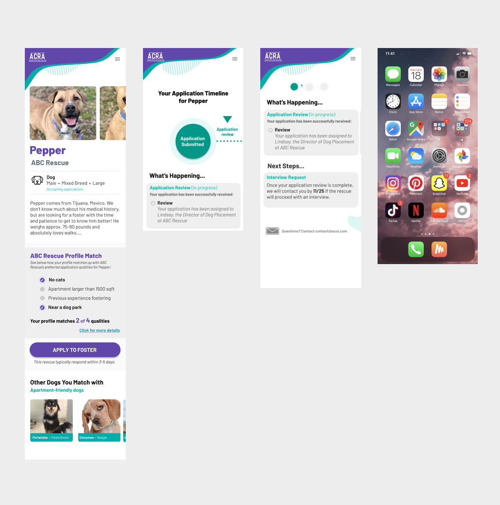
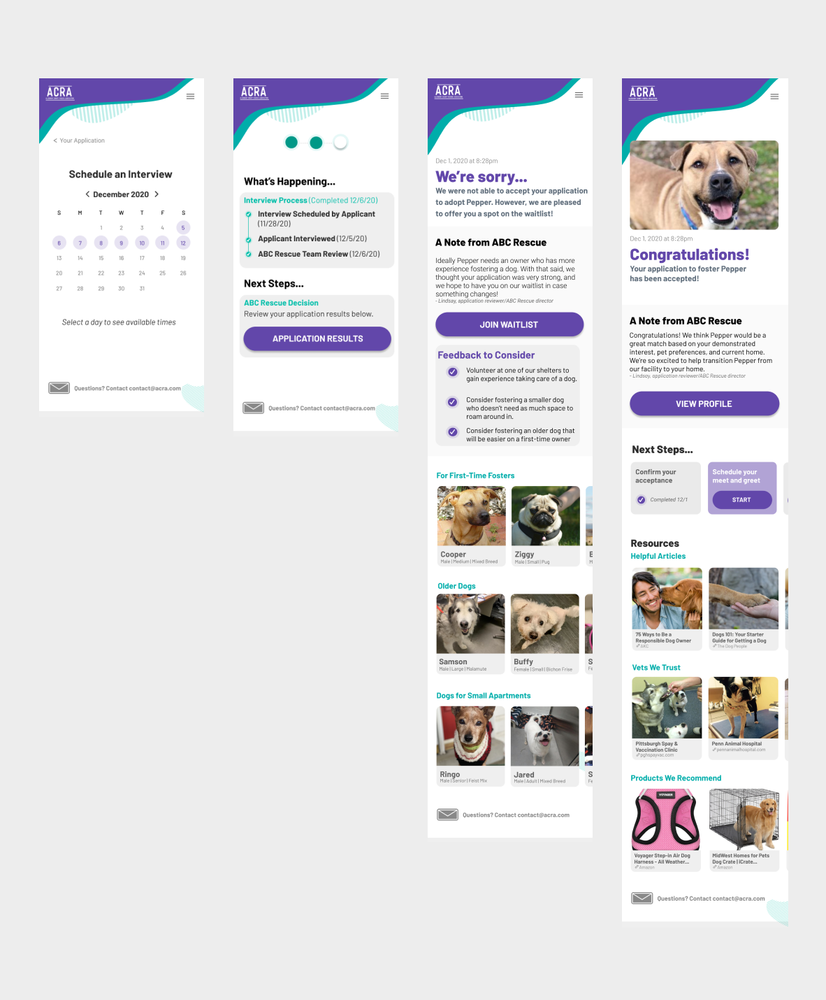
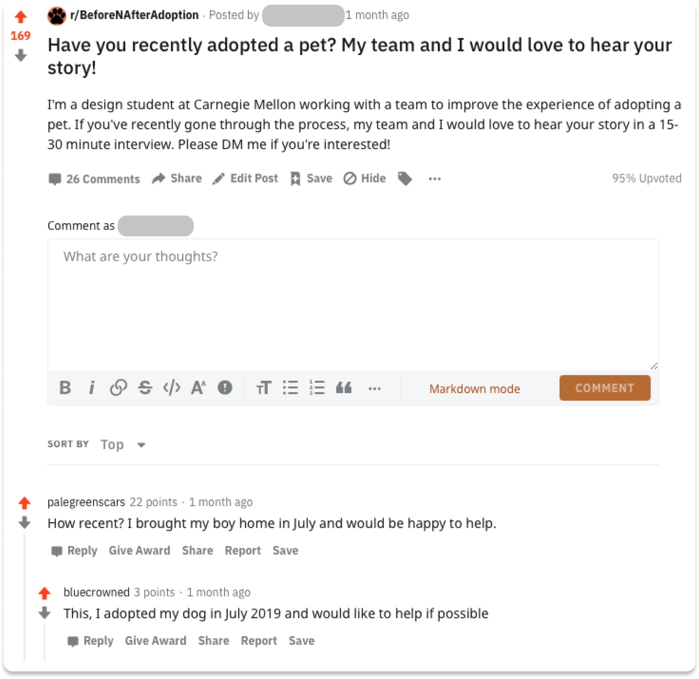
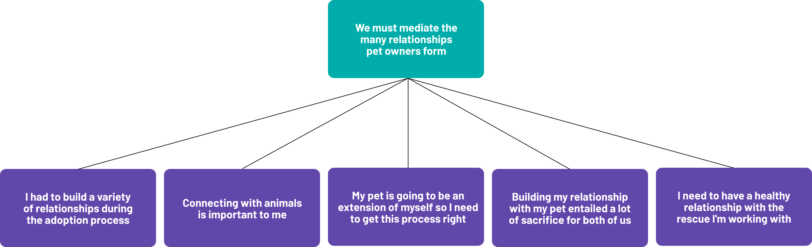
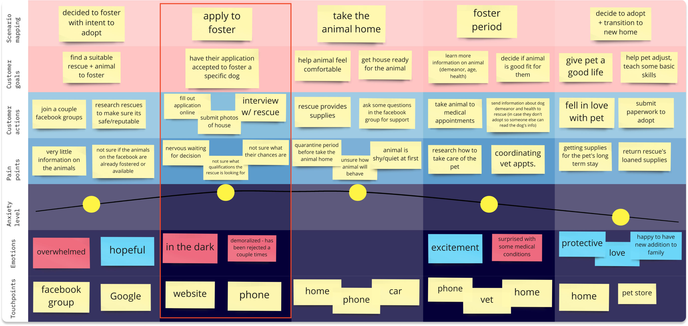
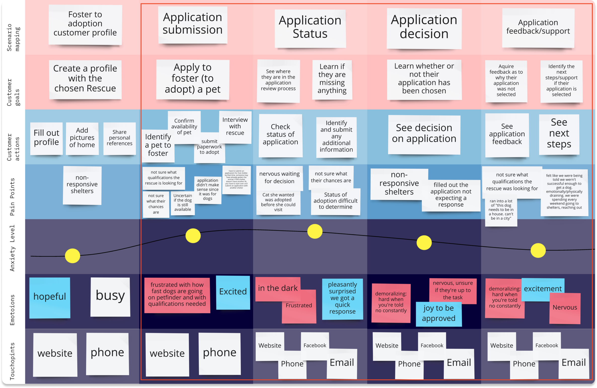
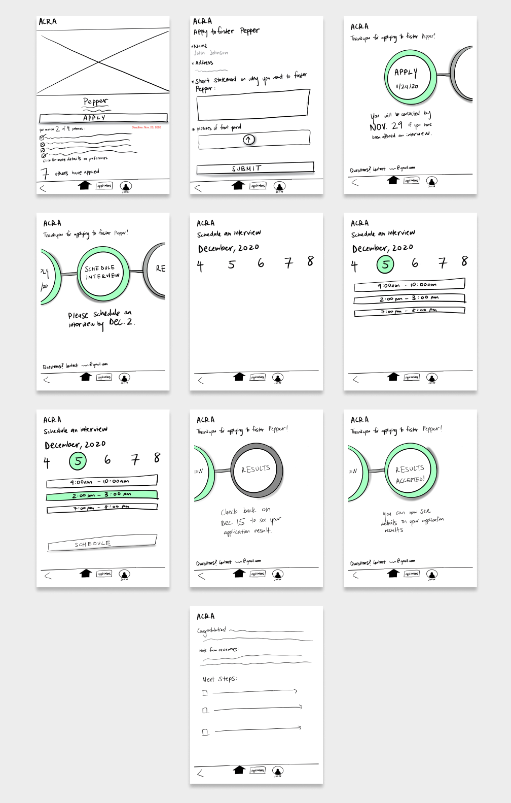
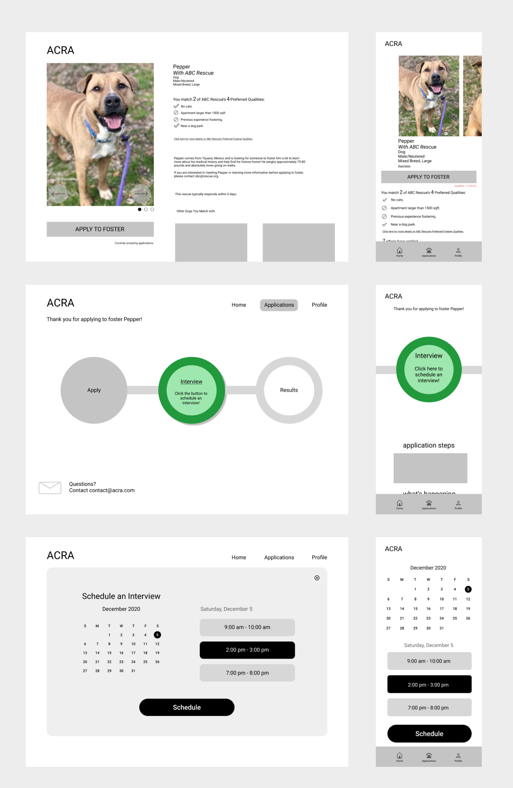
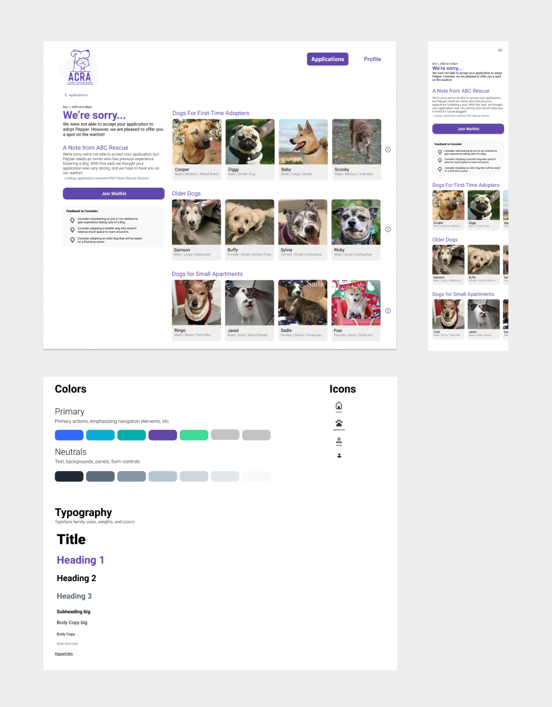

## Overview

My team and I created a responsive mobile and desktop web design for a fictional client, the Allegheny County Rescue Association (ACRA). The ACRA’s goal is to save as many animals as possible while maintaining financial stability as a nonprofit. Our solution targeted the user pain point of lack of transparency in the application process. A more transparent application process means higher quality applications and efficient time management, which ultimately allows the ACRA to collect more fees and save more animals.

I worked within a team of five designers over the course of five weeks, and I played a key role in the experience design, interface design, and design research for this project.

## Final Prototype

To increase transparency in the pet fostering process, we showed users how a given pet matched with their profile. In this case, the potential owner match 2 out of the 4 criteria Pepper needs in a home. Next, we used a timeline to help users understand where they were in the process and what to expect next.

When the user passes the interview stage, the user can receive one of three results after several weeks: an acceptance, a waitlist, and a rejection. We decided to showcase a waitlist decision that eventually leads to the user being accepted off of it. That way, we could show two of the possible results in a natural manner rather than simply presenting the two as alternatives.

<a href="https://www.figma.com/proto/32d3vYLwoPrROHQ4OStTAp/Hi-Fi-Mobile?node-id=241%3A1019&viewport=454%2C967%2C0.12353640049695969&scaling=scale-down" target="_blank">Mobile Prototype</a>

<a href="https://www.figma.com/proto/3vkikLzlKgMc34z33o9Fb5/Hi-Fi-Desktop?node-id=1%3A634&viewport=291%2C579%2C0.07974327355623245&scaling=scale-down-width" target="_blank">Desktop Prototype</a>

If you're wondering how we got here, keep scrolling!

## Research

### Recruiting our Participants

To begin our research process, our team members agreed we were all interested in improving the pet fostering experience, however, none of us had recently fostered a pet or knew anyone who did. How might we recruit 15 participants in less than a week during a pandemic? Reddit! I posted on a number of pet-related subreddits to find pet owners who would be willing to speak with us, and the subreddit r/BeforeNAfterAdoption was very kind to us. We ended up receiving well over 15 interested participants. In hindsight, it’s no surprise people wanted to share their pet adoption stories!

### Conducting our Interviews

With our recruiting pipeline set up, it was time to figure out our interview guide. We used the Directed Storytelling method in our interviews, asking each participant to recount their most recent experience adopting or fostering a pet and asking follow-up questions from there. We mainly interviewed people who recently adopted a pet, and we were also lucky enough to hear from people who either ran or volunteered at rescues, and their perspective was invaluable. As we conducted our interviews, we individually filled out journey maps which we then consolidated into an affinity map, the key findings of which we present next.

### Key Insights

#### We Must Mediate Relationships Pet Owners Form

One way in which I made sense of our interviews was by creating an affinity map. At a high-level, what I came to understand from our interviews is that, throughout the pet ownership process, pet owners build relationships with other stakeholders like the rescue or their veterinarian, and that in order for us to improve the pet fostering application experience, we must mediate those relationships with their nuance in mind.

#### Pet Owners are Willing to Make Sacrifices

While the most important relationship a pet owner forms is the one with their pet, it truly takes a village. Before even making the decision to foster, future pet owners often had to make significant life changes like moving, or they had to convince skeptical partners, yet all our participants were willing to make sacrifices because they truly care for animals and wanted to connect with them. Drawing from our affinity map, we sought next to consolidate our findings into a journey map to help narrow our problem space.

### Consolidated Journey Map

In addition to affinity mapping, we consolidated the journey maps we created after each interview into one journey map in order to refine our understanding of the pet fostering experience.

We chose to focus on the apply to foster phase because we believed a responsive interaction design could address the lack of transparency into the process for prospective pet fosterers. Next, we built out a journey map within the apply to foster phase to refine our understanding of this part of the problem space.

### Focus Area Journey Map

We further narrowed in on the point in time after the user has filled out a basic profile since what comes after has fewer established design patterns. Now that we had sufficiently narrowed our scope, we began prototyping our ideas on paper.

## Design

### Paper Prototype

To begin the design phase of our project, we created individual paper prototypes to accomplish the goal of increasing transparency into the process of finding an animal, applying to foster it, and receiving the application’s results. We met to present our ideas and took note of what aspects worked well in our individual sketches before taking to one iPad to draw out a synthesized paper prototype combining the best of our ideas.

From our in-class critique, we learned that several word choices impacted how our design was received. The phrase “7 others have applied” caused confusion among both groups of students we received critique from, with one saying this would deter them from applying and the other saying it would motivate them to apply quicker. We ultimately decided to take this phrase out entirely because the application process for fostering is done on a rolling basis, so the number of applicants would also need more information on the stage of applying they are on. Instead, we included a line saying the animal was available for applications because this made more sense in the fostering context.

Moving to our digital prototype, we also kept in mind that visual affordances would be key, since our paper prototype testers had confusions about what was clickable.

### Mid-Fi Prototype

#### Iteration 1

For our first iteration of the Mid-Fi prototype, we individually focused on a different part of the prototype and built those pages out.

We implemented changes from previous critiques, focusing mainly on creating clearer visual affordances. Since we were now working on a digital prototype in higher fidelity, we incorporated more details and visual design elements that would work to tackle these problems.

In order to make for a clearer call to action, we edited our use of icons and underlining. To increase visibility, we added more context on the timeline using intermediate steps.

#### Iteration 2

While our first Mid-Fi prototype worked to tackle clearer call to action and increased visibility, our in-class critique showed us that there was still room for improvement in these areas. We were prompted to further clarify situations such as the rejection process.

In our second iteration, we tackled these by fleshing out each page in greater detail. We created a rejection page and more text to explain each situation.

Moving into our final prototype, we also focused more heavily on visual design, tackling issues with whitespace, crowding, and consistency across pages. We improved the visual design by creating a design system to allow for consistent screens and branding. We also added digital prototyping elements such as vertical scrolling, horizontal modules, and other interactions.

## Takeaways

I’m so proud of the work our team put in. Each team member brought something unique to the table that meshed really well with everyone else’s contributions. Designing in service of animals and their owners brought warm feelings to my heart throughout the process, and knowing our design might help a rescue save more animals made all the hours I put in worth it! This project also helped me narrow in on my interest in research. I realized how much I wanted to understand and advocate for the people who would be using our product, and I noticed how impactful having a thorough understanding of who our user was and what they needed made for a smoother and more impactful design process.
