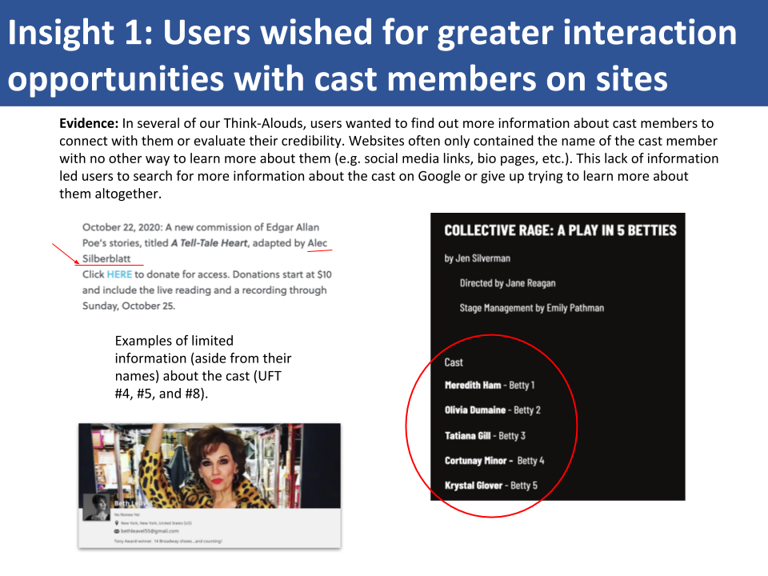
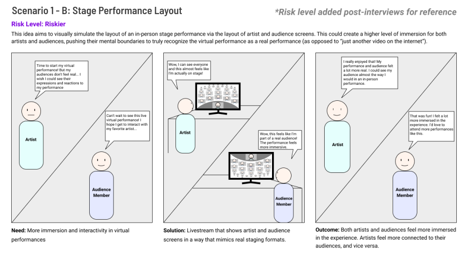

## Team Members

Akshaya Madhavan, Amy Zhuang, Eileen You, Emmet Mack, Jenny Ong, Victor Grajski

## Executive Summary

Showscape is a performance streaming platform catered to artists and their audiences. While platforms like Twitch and Zoom enable creators to perform live online, they do not provide the immersive experience artists and audiences have come to expect from physical performances. For our client, the Kelly Strayhorn Theater in Pittsburgh, PA, we sought not only to replicate what works in physical theater online, but to augment and reify the online experience to make it more conducive to theater. We arrived at our solution by conducting generative research using a variety of methods with both artists and audience members to understand their pain points. We then developed early-stage prototypes and evaluated with artists and audience members how well we addressed their pain points. Our prototypes were well-received by both artists and audience members; artists particularly liked how they were in control of how they presented to audiences, and audiences appreciated the tools we provided to interact with artists.

## Problem

The pandemic has changed the landscape for performing arts across the world. With less freedom to leave our homes, our client, the Kelly Strayhorn Theater, asked the students in our User Research to explore how we might be able to transform the physical theater experience into a shared online experience. Our first question was: Doesn’t Zoom do that already? As we would come to find out, the answer is the classic “Well, it depends.”

## Methods

Throughout our research, we recruited a mix of artists and audience members to learn more about needs and pain points from both sides of the stage. We chose to interview both artists and audience members because of the relationship each forms with the other during a performance. By diving right into the middle of that relationship, we hoped to form a nuanced understanding of what wasn’t working with existing tools for online performance.

The first method we employed was Think Aloud for generative research. The goal of these sessions was to learn more about our problem space while generating ideas for further research. We conducted six sessions with a 50/50 mix of artists and audience members using websites in the online theater space like Zoom Theatre, Dramaversity, and Broadway.com. We chose these websites because they were similar to Kelly Strayhorn’s, and we believed looking at similar sites would help us understand what Kelly Strayhorn was already doing well compared to how they might improve. In each session, we asked participants to perform three tasks: learn about an event you find interesting and sign up for it, learn one fact about a specific cast member, and navigate to one of the performer’s social media accounts and read one of their posts. We chose these tasks because we believed they were central to how audience members take in a physical performance. More specifically, audience members typically find out about physical performances online, and while at a show, they often look at the Playbill to learn more about the cast, and they may even seek out those cast members on social media during or after the show.

The second method we employed was Contextual Inquiry. Our main question going into this phase of the research was: How might we enable artists to engage more with their audiences in a virtual setting? We settled on this question after finding in our Think Aloud sessions that participants felt disappointed when they weren’t able to find out more information about a cast member. Thus, we hypothesized that connecting artists with their audience is crucial in translating the physical theater into an online experience. We also hypothesized that artists who were not accustomed to performing virtually would find it difficult to reach out to their audiences and form personal connections with them given there are a number of existing platforms with some artists present, but there did not seem to be a critical mass. To shed light on our hypotheses, we conducted inquiries with six artists. Within each session, we asked each artist to bring an artifact they have used to perform or collaborate online to guide the conversation and add context. We then synthesized our findings into an Affinity Map.

Next, we conducted Speed Dating sessions using storyboards we had developed based on our Contextual Inquiry findings. We recruited a mix of artists and audience members in order to evaluate the ideas we generated across both segments. In keeping with the rapid-fire tradition of the Speed Dating method, we spent a maximum of three minutes with each participant on each storyboard in order to get their gut reactions to each idea.

Using the feedback we received in our Speed Dating sessions, we voted on a single potential solution to focus on as a team and create a prototype around. We chose the idea of a streaming platform geared specifically towards a theater context because it solved for the main issue we had uncovered across all our previous research: the disconnect between the artist and the audience during a virtual performance. We created a low-fidelity prototype in Figma and evaluated it across six sessions with a 50/50 mix of artists and audience members.

After wrapping up our prototyping sessions, we presented our findings to representatives from Kelly Strayhorn as well as guest critiquers in the UX space. We devised a two-minute elevator pitch and created a poster to facilitate a Q&A session afterwards.

## Evidence

Early in our process, during the Contextual Inquiry stage, one quote that influenced how I viewed the problem space and what solution we may propose came from an artist we interviewed. She said,

> “I hate the idea that ‘this [quarantine] is the opportunity to create something different.’ I want to create
> what I want, as best as possible, even with limited resources. I would rather stop creating and wait until
> the world rights itself to be more conducive to my (in person) creative process.”

Hearing this inspired me to explore further what has been lost about making and performing art online, ask how might we replicate what is lost, and ask how might we go beyond replicating the experience and towards augmenting it?

During another contextual inquiry session, one participant lamented about one of the biggest pain points he has faced watching performances online. He said,

> “In person, I always went to shows in groups. Virtually, only one thing was with another person. Everything
> else was alone. It wasn’t the same. We were on facetime while we were watching. We had to mute each other.
> It didn’t work that well. At the theater, there is an energy you’re sharing with performers and the other
> audience members, no way to duplicate that with the remote format.”

In our Speed Dating phase, the way one participant described how a proposed performance streaming platform would make her feel showed me how much context of use and look and feel can influence the experience of a fundamental technology like videoconferencing. She said,

> “I use Zoom professionally. It really feels like a work event. We all associate it with work. With artists,
> those little vibe things really do matter. Instagram Live is cute fun, but it doesn’t have the feeling of a
> produced show. Even basic thematic things are helpful such as a similar color scheme. It feels like less of
> a compromise when the whole interface feels intentional.”

## Insights

Along the way we honed in on two key insights that informed our solution. We learned that current streaming platforms limit the online theater experience because they remove the unique associations of attending a real theater, such as the grand atmosphere, the presence of the actors, and a collective audience experience. We also found that many artists and audience members feel less connected online. Artists want to feel like their audience is present during the performance, barring extreme distractions. Audience members want to feel that they are in the presence of a larger group, but they also want to have more nuanced interactions with small groups of friends or family.

## Solution

Our goal with Showscape is to reduce the barrier between artists and audiences by reifying and augmenting the theater experience with features unique to a virtual space. This includes customizable viewing options, such as private watch party rooms for audience groups that allow for a more intimate way to experience performances, and real-time audience and artist interactions. On the artist side, Showscape features highly customizable performance set-up options that allow artists to fully control how their content is presented. Audiences can show their support for artists with reactions or through donations and buying a virtual rose. These features all help bring artists and audiences closer together and back into a more familiar context. Through our platform, we believe users will enjoy the online theater experience for the first time.

### Audience Prototype

<iframe style="border: 1px solid rgba(0, 0, 0, 0.1);" width="800" height="600" src="https://www.figma.com/embed?embed_host=share&url=https%3A%2F%2Fwww.figma.com%2Fproto%2F4Alh7IGcj7KdqDXUZw50G9%2FAudience%3Fnode-id%3D1%253A11%26viewport%3D590%252C424%252C0.10740659385919571%26scaling%3Dcontain"></iframe>

### Artist Prototype

<iframe style="border: 1px solid rgba(0, 0, 0, 0.1);" width="800" height="600" src="https://www.figma.com/embed?embed_host=share&url=https%3A%2F%2Fwww.figma.com%2Fproto%2FVDAyTB7PmgLSVTLmN8mm1L%2FArtist-Prototype%3Fnode-id%3D1%253A40%26viewport%3D409%252C499%252C0.09296385943889618%26scaling%3Dscale-down"></iframe>
